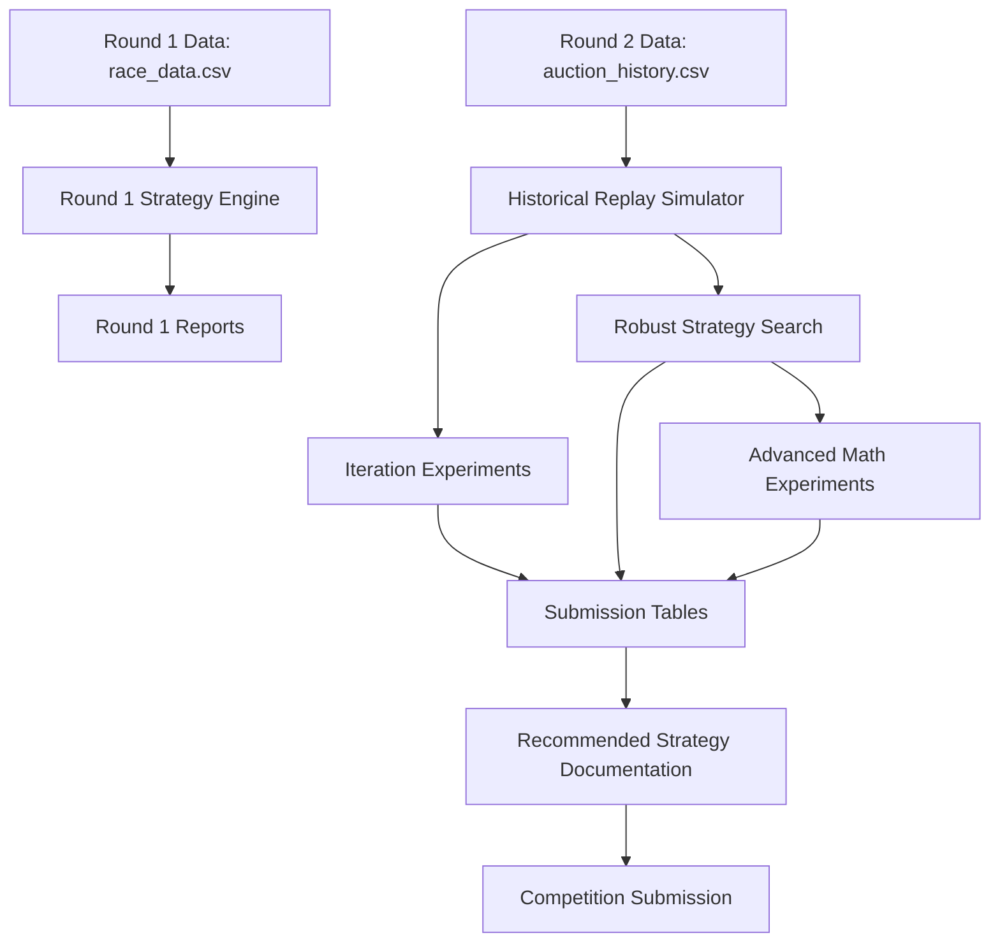
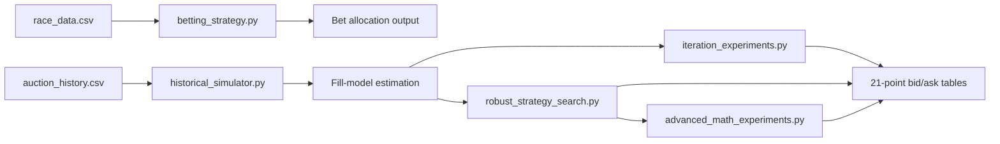

# System Architecture

## High-Level System Architecture

## Data-Flow Diagram

## Architectural Notes
- Round 1 is a deterministic EV/Kelly workflow.
- Round 2 is a layered simulation-and-optimization workflow:
  - deterministic historical replay baseline
  - robustness-focused synthetic scenario optimization
  - advanced math and risk diagnostics
- Data files are colocated with scripts for portable, script-relative execution.
