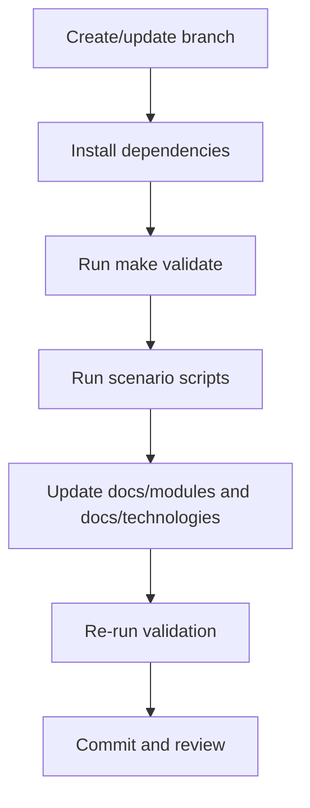
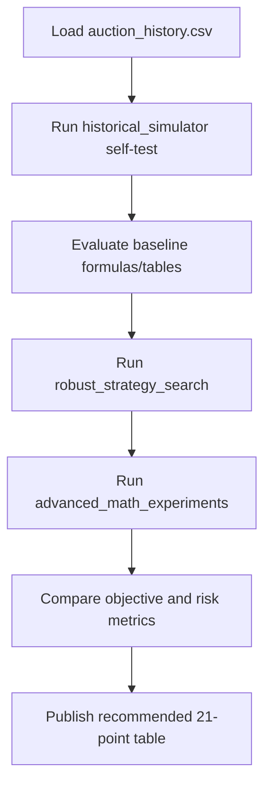

# Development and Analysis Workflows

## Standard Development Workflow

## Round 2 Strategy Workflow

## Operational Commands
- Compile-time checks: `make validate`
- Round 1 strategy run: `make round1`
- Round 2 baseline checks: `make round2-self-test`
